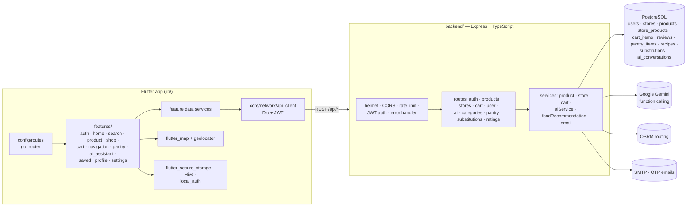

# ShopRoute

**A smart local-shopping app. Find which nearby stores stock what you need, build a cart across stores, and get an optimised driving route that covers your whole list in as few stops as possible, with a Gemini shopping assistant and a pantry tracker.**

ShopRoute is a cross-platform **Flutter** app backed by a **Node.js + Express + PostgreSQL** API. It ships seeded with store and product data for Coimbatore.

---

## Features

- **Store and product discovery:** browse categories, search with suggestions, view product details, see which stores carry an item and at what price, read reviews, and find nearby stores on a map
- **Multi-store cart:** add items from different shops into one cart
- **Route optimisation:** a greedy set-cover picks the smallest set of stores that covers the cart, then **OSRM** returns the driving route, shown with `flutter_map`
- **AI assistant (Gemini, function calling):** handles requests like *"where can I buy paneer near me?"* or *"add milk and plan my route"* using the tools `find_stores`, `get_store_products`, `add_to_cart`, `view_cart` and `optimize_route`
- **Pantry:** track items at home with **expiring-soon** and **low-stock** views, get recipe suggestions from what's in the pantry, and see product substitutions
- **Accounts:** register with email OTP verification, log in, forgot or reset password, JWT auth, secure token storage and optional biometric unlock
- Ratings and reviews, saved items, profile and settings, and a light/dark theme

## Architecture



### Route optimisation

1. Gather the cart items and the stores that stock each one.
2. Repeatedly pick the store that covers the most remaining items (greedy set cover) until every item is covered.
3. Send the user's location and the chosen stores to OSRM `/route/v1/driving` and return the GeoJSON route, distance and duration to the app's route summary page.

## Getting started

### Backend

```bash
cd backend
npm install
cp .env.example .env     # DATABASE_URL, JWT_SECRET, GEMINI_API_KEY, SMTP_*, OSRM_SERVER_URL
psql "$DATABASE_URL" -f sql/schema.sql
psql "$DATABASE_URL" -f sql/schema_pantry.sql
psql "$DATABASE_URL" -f sql/triggers.sql
psql "$DATABASE_URL" -f sql/seed_coimbatore_v1.sql
npm run dev              # ts-node-dev
```

### App

```bash
flutter pub get
flutter run              # set the API base URL in lib/config/constants/api_endpoints.dart
```

## Project structure

```
shoproute/
├── lib/
│   ├── config/      # routes, theme, constants (API endpoints)
│   ├── core/        # API client, shared widgets
│   └── features/    # one folder per feature (data + presentation)
├── backend/
│   ├── src/         # app.ts, routes, services, middleware, config
│   └── sql/         # schema, pantry schema, triggers, Coimbatore seed
└── android/ ios/ web/ windows/ macos/ linux/
```

## Tech stack

Flutter · Dart · go_router · Provider/BLoC · Dio · flutter_map · geolocator · Hive · Node.js · Express · TypeScript · PostgreSQL · Google Gemini · OSRM · Nodemailer · JWT · Helmet
